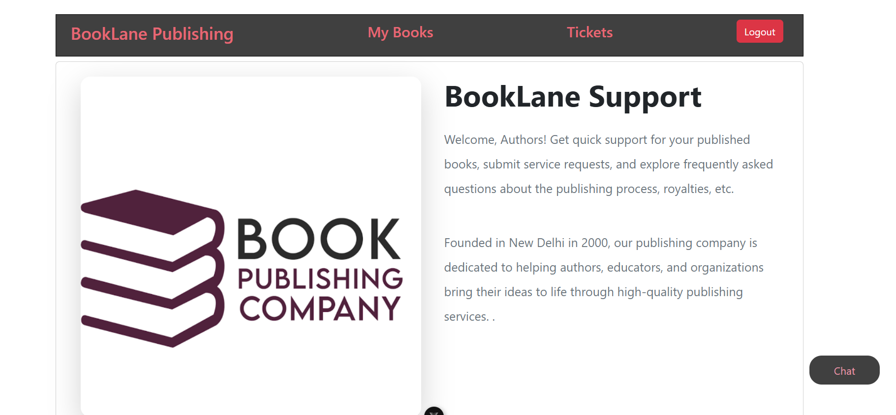
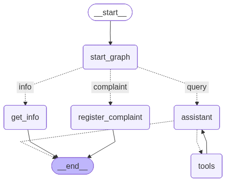

# Customer Support



Application is built using FastAPI, Vue, LangGraph to help automate authors query resolution.


## LangGraph Workflow Diagram



## About
Authors get quick support on published books, submit requests/complaints, and explore frequently asked questions about the publishing process, royalties, etc.
Instant agentic chat to anwer all your queries. A RAG and agentic AI implementation to help resolve tickets/queries


## Key Features

- Authors can login and ask queries regarding their books or other FAQ like royalties, publishing timelines, etc
- Chat functionality to help resolve author's queries through RAG. Admin can intervene and answer complex queries.
- Ticket creation and real time resolution using lon polling and webhook.

## Tech Stack

- Language: (Python, JavaScript)
- Web framework: (Django, Vue)
- Data store: (SQLite/PostgreSQL)
- AI Agent: (LangChain/LangGraph)

## ERD

```

+--------------------+        +-----------------------------+        +-----------------------------+
|       User         | 1    * |            Book             | 1    * |           Ticket            |
|--------------------|--------|-----------------------------|--------|-----------------------------|
| id (PK)            |        | id (PK)                     |        | id (PK)                     |
| username           |        | author_id (FK -> User.id)   |        | query                       |
| email              |        | title                       |        | book_id (FK -> Book.id)     |
| ...                |        | isbn                        |        | status                      |
+--------------------+        | genre                       |        | response                    |
                              | pub_date                    |        +-----------------------------+                            
                              +-----------------------------+                          
                              
```

## Configuration

- Ensure required environment variables are set in the backend -> support directory before running the app.
```POSTGRES_DB=support
POSTGRES_USER=postgres
POSTGRES_PASSWORD=hello2020
POSTGRES_HOST=db
POSTGRES_PORT=5432
SECRET_KEY=django-insecure-rb8qsms&__!2x%xq
OPENAI_API_KEY="Your OpenAI key"
```

## Installation

docker compose up --build -d

Update these steps to match the project's actual dependency manager and commands.


## Author Login
Login with author username by combining first as last name with _
Example - Sneha_Kulkarni
password - hellYeah2020

## Staff Login

Login with following credentials to resolve tickets (Open staff in seperate window).
- username: vikas@gmail.com
  password: hello2020
